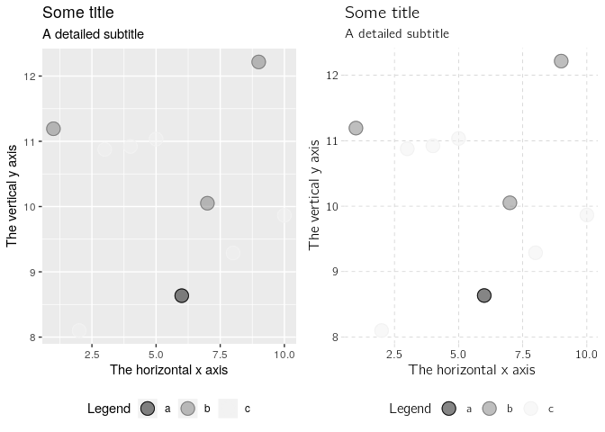

<!-- README.md is generated from README.Rmd. Please edit that file -->
SFI and databrew project
========================

Here are some instructions:

1.  Do this.
2.  Do that.

``` r
barplot(1:10)
```


